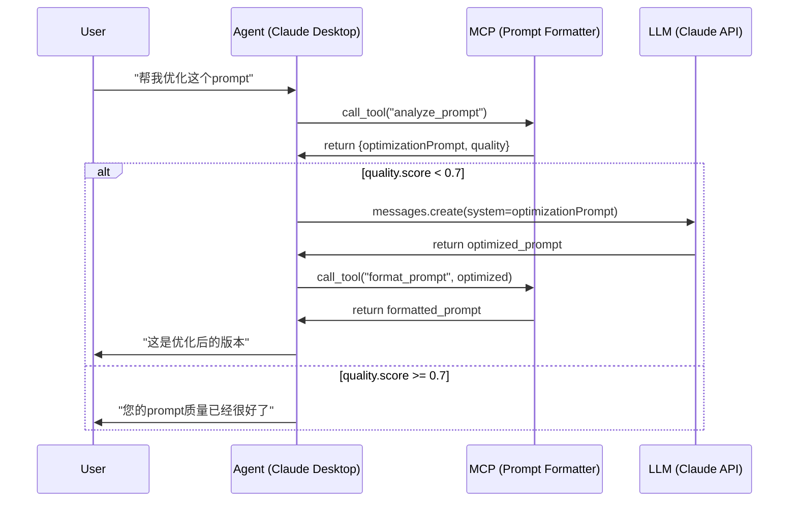

# LLM Optimization Guide

> **关键问题：如果这些规则都不满足，哪里可以让agent自己调用LLM去优化prompt呢？**

本文档解释了在MCP服务中，Agent（如Claude Desktop）如何使用LLM来智能优化用户的prompt。

---

## 设计理念

我们的prompt formatter采用**分层优化**策略：

```
Layer 1: MCP服务（规则引擎）
  ↓ 提供结构化分析
Layer 2: Agent（智能优化）
  ↓ 基于分析结果，调用LLM优化
Layer 3: 用户（最终决策）
```

**为什么这样设计？**
- MCP服务负责**无状态的规则处理**（快速、确定性）
- Agent负责**有状态的智能决策**（可以调用LLM、访问上下文）
- 用户最终决定是否采纳

---

## MCP服务提供的优化接口

### 1. `analyze_prompt` 工具

这是Agent获取优化建议的主要入口：

```typescript
// MCP Tool: analyze_prompt
{
  "prompt": "你的原始prompt",
  "targetModel": "claude" // 或 "gpt" / "generic"
}

// 返回结果
{
  "sections": { ... },           // 检测到的section
  "quality": { ... },            // 质量评分
  "issues": [ ... ],             // 识别的问题
  "missingSections": [ ... ],    // 缺失的section
  "suggestions": [ ... ],        // 改进建议
  "optimizationPrompt": "..."    // ⭐ 这是给Agent的优化指令
}
```

### 2. `optimizationPrompt` 字段

这个字段**专门为Agent准备**，包含了智能优化所需的所有信息：

**示例输出：**
```
To improve this prompt for claude:

Claude-specific recommendations:
- Use XML tags for better structure (<introduction>, <rules>, <examples>)
- Include thinking tags <thinking> for complex reasoning tasks
- Provide clear examples with input/output pairs

Missing sections to add:
- Add a role definition (e.g., "You are a professional...")
- Add 1-2 examples showing expected input/output

Quality improvements:
- Improve clarity by using standard markers (Rule:, Example:, etc.)
- Add examples to illustrate expected behavior and improve model performance
```

---

## Agent如何使用LLM优化

### 工作流程

```
用户 → "帮我优化这个prompt"
  ↓
Agent → 调用 MCP analyze_prompt
  ↓
MCP → 返回 optimizationPrompt
  ↓
Agent → 将 optimizationPrompt 作为system prompt
  ↓
Agent → 调用 LLM (Claude/GPT) 生成优化版本
  ↓
Agent → 将优化后的prompt返回给用户
```

### 实际使用示例

**场景1: 用户提供简单的、非结构化的prompt**

```python
# 用户原始prompt
user_prompt = """
你是翻译助手。必须准确翻译。要保持原文风格。
翻译下面的文本：[文本内容]
"""

# Agent工作流
1. agent.call_mcp_tool("analyze_prompt", {
     "prompt": user_prompt,
     "targetModel": "claude"
   })

2. mcp_result = {
     "optimizationPrompt": "To improve this prompt for claude:\n- Use XML tags...",
     "missingSections": ["examples"],
     "quality": { "overallScore": 0.45 }
   }

3. agent.call_llm({
     "system": mcp_result["optimizationPrompt"],
     "user": f"请优化以下prompt:\n\n{user_prompt}"
   })

4. llm_response = """
<introduction>
你是一位专业的翻译助手，擅长在保持原文风格和准确性的同时，提供高质量的翻译。
</introduction>

<rules>
  <rule>必须准确传达原文的含义，不得增删内容</rule>
  <rule>保持原文的语气、风格和格调</rule>
  <rule>专业术语应使用标准译法</rule>
</rules>

<examples>
  <example>
    <input>The weather is nice today.</input>
    <output>今天天气真好。</output>
  </example>
</examples>

<task>
请翻译以下文本：[文本内容]
</task>
"""

5. agent.present_to_user(llm_response)
```

**场景2: 用户提供中文prompt，使用了冒号分段**

```python
# 用户原始prompt
user_prompt = """
规则: 必须用JSON格式返回

举例来说: 输入一个数字，输出它的平方

现在请处理数字42
"""

# MCP会自动识别（增强版detector）
1. enhanced_detector.detect(user_prompt)
   # 识别结果：
   # rules: ["必须用JSON格式返回"]
   # examples: ["输入一个数字，输出它的平方"]
   # task: ["现在请处理数字42"]

2. mcp返回optimizationPrompt:
   "To improve this prompt for claude:
   - Add role definition
   - Examples should include actual input/output pairs
   - Specify exact JSON schema"

3. Agent调用LLM优化，得到：
"""
<introduction>
你是一个数学计算助手，负责处理数值计算任务。
</introduction>

<rules>
  <rule>必须以JSON格式返回结果</rule>
  <rule>JSON格式: {"input": number, "output": number, "operation": string}</rule>
</rules>

<examples>
  <example>
    <input>5</input>
    <output>{"input": 5, "output": 25, "operation": "square"}</output>
  </example>
</examples>

<task>
请处理数字42，计算它的平方，并以JSON格式返回。
</task>
"""
```

---

## Agent集成示例代码

### Python示例 (使用Claude API)

```python
import anthropic
from mcp import ClientSession

class PromptOptimizer:
    def __init__(self, mcp_session: ClientSession, anthropic_client: anthropic.Anthropic):
        self.mcp = mcp_session
        self.claude = anthropic_client

    async def optimize_prompt(
        self,
        user_prompt: str,
        target_model: str = "claude"
    ) -> dict:
        """
        使用MCP分析 + LLM优化，返回优化后的prompt
        """
        # Step 1: 调用MCP analyze_prompt
        analysis = await self.mcp.call_tool(
            "analyze_prompt",
            arguments={
                "prompt": user_prompt,
                "targetModel": target_model
            }
        )

        # Step 2: 提取优化指令
        optimization_prompt = analysis["optimizationPrompt"]
        quality_score = analysis["quality"]["overallScore"]

        # Step 3: 如果质量分数较低，使用LLM优化
        if quality_score < 0.7:
            optimized = await self._call_llm_for_optimization(
                user_prompt,
                optimization_prompt,
                target_model
            )
            return {
                "original": user_prompt,
                "optimized": optimized,
                "quality_before": quality_score,
                "suggestions": analysis["suggestions"],
                "improved": True
            }
        else:
            return {
                "original": user_prompt,
                "optimized": user_prompt,
                "quality_before": quality_score,
                "suggestions": [],
                "improved": False,
                "message": "Prompt quality is already good!"
            }

    async def _call_llm_for_optimization(
        self,
        original_prompt: str,
        optimization_instructions: str,
        target_model: str
    ) -> str:
        """
        调用LLM进行智能优化
        """
        system_prompt = f"""你是一个prompt工程专家。

{optimization_instructions}

请根据上述建议优化用户提供的prompt。保持原意，但改进结构和清晰度。"""

        message = self.claude.messages.create(
            model="claude-3-5-sonnet-20241022",
            max_tokens=2000,
            system=system_prompt,
            messages=[
                {
                    "role": "user",
                    "content": f"请优化以下prompt:\n\n{original_prompt}"
                }
            ]
        )

        return message.content[0].text


# 使用示例
async def main():
    mcp_session = await connect_to_mcp("prompt-formatter-mcp")
    claude_client = anthropic.Anthropic(api_key="...")

    optimizer = PromptOptimizer(mcp_session, claude_client)

    result = await optimizer.optimize_prompt(
        user_prompt="你是翻译助手。翻译这段文字：hello world",
        target_model="claude"
    )

    print("原始prompt:", result["original"])
    print("优化后:", result["optimized"])
    print("质量提升:", result["improved"])
```

### TypeScript示例 (Claude Desktop集成)

```typescript
import Anthropic from '@anthropic-ai/sdk';
import { Client } from '@modelcontextprotocol/sdk/client/index.js';

class PromptOptimizerAgent {
  constructor(
    private mcpClient: Client,
    private anthropic: Anthropic
  ) {}

  async optimizePrompt(
    userPrompt: string,
    targetModel: 'claude' | 'gpt' | 'generic' = 'claude'
  ): Promise<{
    original: string;
    optimized: string;
    qualityBefore: number;
    qualityAfter: number;
  }> {
    // Step 1: Analyze with MCP
    const analysisResult = await this.mcpClient.callTool({
      name: 'analyze_prompt',
      arguments: {
        prompt: userPrompt,
        targetModel: targetModel,
      },
    });

    const analysis = JSON.parse(analysisResult.content[0].text);
    const { optimizationPrompt, quality } = analysis;

    // Step 2: Check if optimization is needed
    if (quality.overallScore >= 0.7) {
      return {
        original: userPrompt,
        optimized: userPrompt,
        qualityBefore: quality.overallScore,
        qualityAfter: quality.overallScore,
      };
    }

    // Step 3: Call LLM for optimization
    const optimized = await this.callLLMForOptimization(
      userPrompt,
      optimizationPrompt
    );

    // Step 4: Verify optimization worked
    const newAnalysis = await this.mcpClient.callTool({
      name: 'analyze_prompt',
      arguments: {
        prompt: optimized,
        targetModel: targetModel,
      },
    });

    const newQuality = JSON.parse(newAnalysis.content[0].text).quality;

    return {
      original: userPrompt,
      optimized: optimized,
      qualityBefore: quality.overallScore,
      qualityAfter: newQuality.overallScore,
    };
  }

  private async callLLMForOptimization(
    original: string,
    instructions: string
  ): Promise<string> {
    const response = await this.anthropic.messages.create({
      model: 'claude-3-5-sonnet-20241022',
      max_tokens: 2000,
      system: `You are a prompt engineering expert.\n\n${instructions}\n\nOptimize the user's prompt according to these instructions while preserving the original intent.`,
      messages: [
        {
          role: 'user',
          content: `Please optimize this prompt:\n\n${original}`,
        },
      ],
    });

    return response.content[0].text;
  }
}
```

---

## 关键决策点

### 什么时候Agent应该调用LLM？

```typescript
// 决策逻辑示例
async function shouldOptimizeWithLLM(analysis: AnalysisResult): Promise<boolean> {
  // 1. 质量分数低
  if (analysis.quality.overallScore < 0.6) {
    return true;
  }

  // 2. 缺少关键section
  const criticalSections = ['task', 'introduction'];
  const missingCritical = analysis.missingSections.some(s =>
    criticalSections.includes(s)
  );
  if (missingCritical) {
    return true;
  }

  // 3. 有严重问题
  const hasCriticalIssues = analysis.issues.some(i =>
    i.severity === 'high'
  );
  if (hasCriticalIssues) {
    return true;
  }

  // 4. 用户明确要求优化
  // (需要从对话context判断)

  return false;
}
```

### 优化策略

| 场景 | MCP角色 | Agent角色 | LLM是否必需 |
|------|---------|-----------|-------------|
| 格式转换（XML→Markdown） | 执行转换 | 验证结果 | ❌ 否 |
| 添加缺失section | 提供建议 | 生成内容 | ✅ 是 |
| 改进现有内容 | 识别问题 | 重写内容 | ✅ 是 |
| 规则检查 | 执行检查 | 呈现结果 | ❌ 否 |

---

## 完整工作流示例



---

## 最佳实践

### 1. 渐进式优化

```python
# ❌ 不推荐：一次性全部重写
optimized = llm.complete(f"重写这个prompt: {original}")

# ✅ 推荐：基于分析逐步改进
analysis = mcp.analyze(original)
if analysis.missingSections:
    optimized = llm.complete(f"添加 {analysis.missingSections}: {original}")
if analysis.quality.clarityScore < 0.7:
    optimized = llm.complete(f"提高清晰度: {optimized}")
```

### 2. 保持用户意图

```python
# Agent应该向LLM明确强调
system_prompt = f"""
{optimization_instructions}

IMPORTANT:
- Preserve the user's original intent
- Keep domain-specific terminology
- Only improve structure and clarity, don't change the core task
"""
```

### 3. 提供选择权

```python
# 让用户选择是否采纳
result = {
    "original": user_prompt,
    "optimized": optimized_prompt,
    "diff": compute_diff(user_prompt, optimized_prompt),
    "quality_improvement": after_score - before_score
}

# Agent呈现：
# "我为您优化了prompt，质量分数从0.45提升到0.85。
#  主要改进：
#  1. 添加了角色定义
#  2. 增加了2个示例
#
#  [显示对比]
#
#  是否采纳这个优化？"
```

---

## 总结

**核心答案：Agent在以下位置调用LLM优化**

1. **入口**：用户要求优化prompt
2. **判断**：调用`analyze_prompt`获取`optimizationPrompt`
3. **执行**：将`optimizationPrompt`作为system prompt，调用LLM生成优化版本
4. **验证**：可选地再次调用`analyze_prompt`验证优化效果
5. **呈现**：向用户展示对比，让用户决定

**MCP的职责**：
- ✅ 提供结构化分析
- ✅ 提供优化建议（`optimizationPrompt`）
- ✅ 执行格式转换
- ❌ 不调用LLM（保持stateless）

**Agent的职责**：
- ✅ 决策何时需要LLM优化
- ✅ 调用LLM进行智能改进
- ✅ 管理用户交互
- ✅ 保持对话上下文

这种分层设计确保了：
- MCP保持简单、快速、可复用
- Agent拥有完整的智能决策能力
- 用户始终保持控制权
